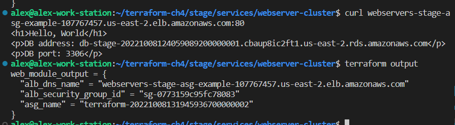

# Task 1: Module Basics

# Task 2: Modules + Environments isolation
1. be aware of remote backend key should put in each sub folder
1. general backend config put to backend.hcl
1. use module variables 
    ref: https://stackoverflow.com/questions/61587712/cannot-get-the-outputs-when-terraform-output-is-run 
1. Add local variables in module
1. Module Output
1. Inline blocks and File paths

# Essential Command
1. `terraform init -backend-config ../../../backend.hcl`
1. `terraform plan`
1. `terraform apply`
1. `terraform output`
1. `terraform destroy`
